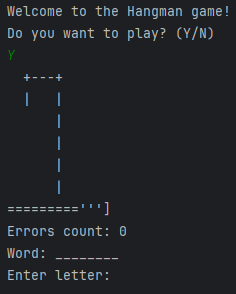
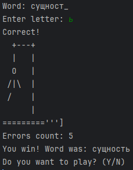

# Проект "Виселица"

[Правила данной игры](https://ru.wikipedia.org/wiki/Виселица_%28игра%29)

## Интерфейс:

Словарь состоит из русских слов.

После того как игра запустилась, будет сгенерировано слово, которое игроку, следует угадать. Если буква, будет совпадать, с вашим выбором, она будет добавлена, на свое место. У Вас будет, лишь 6 попыток, чтобы дойти до финиша, и отгадать слово.

Вы имеете право, писать в любом регистре. Игра будет сводить все к _нижнему_ регистру.

Для запуска необходимо клонировать репозиторий и запустить Main.java:

`git clone https://github.com/Darowiin/Hangman.git`